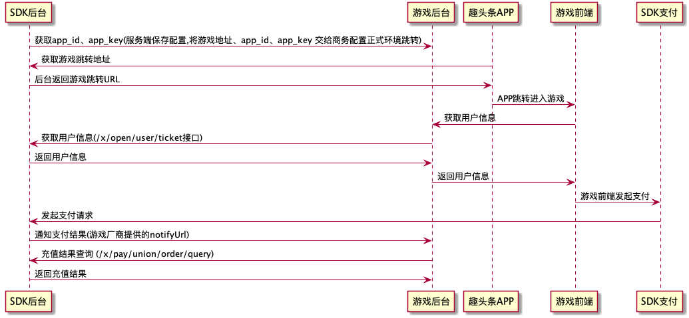

## <font color=#FF0000>*注意：</font>有不确定问题可阅读## [README.md](README.md)文档寻找相关人员
## 游戏中心对应时序图


### 游戏APPID APPKEY 申请地址
http://newidea4-gamecenter-frontend.1sapp.com/opencms/prod/index.html 
(请保留账号密码 暂不支持密码修改)

### 服务器地址

#### 正式：https://newidea4-gamecenter-backend.1sapp.com

### 错误码
| 错误码 | 说明           |
| :----- | :------------- |
| 10001  | 用户不存在     |
| 10002  | ticket已失效   |
| 10003  | appid不存在    |
| 10004  | openid已失效   |
| 10005  | platform不支持 |
| 10006  | sign错误       |
| 10009  | 金币操作异常    |

### 好消息
<font color=#FF0000>通信加密的算法（sign的生成方式），在“通信加密方式”章节，有go、java、php、js四种语言的demo（其他语言持续更新中），复制下即可搞定sign的算法</font>

签名原串示例

```
请求参数列表：app_id=a3x8z92UnQqG&p1=p1v&t1=t1v&d1=d1v&time=1550631186

生成原串要加上参数app_key: app_id=a3x8z92UnQqG&p1=p1v&t1=t1v&d1=d1v&time=1550631186&app_key=LyHrkdpNVSZjHCQldOtBqZ65iu1nBz3QIcYgDKZopsehdH7aM39dftvHcAlbuFfm

原串：app_ida3x8z92UnQqGapp_keyLyHrkdpNVSZjHCQldOtBqZ65iu1nBz3QIcYgDKZopsehdH7aM39dftvHcAlbuFfmd1d1vp1p1vt1t1vtime1550631186

之后参数列表要删除app_key
```

计算出来的sign

```
6154367d349da5b21f308057ad0b009d
```

### 获取用户信息

地址
> /x/open/user/ticket

HTTP 请求方式
> GET

提示：ticket值可在跳转URL中获取(测试环境可参考测试流程文档获取游戏跳转测试地址)

参数

| key      | 必选 | 类型   | 说明                             |
| :------- | :--- | :----- | -------------------------------- |
| app_id   | true | string | 项目 id                          |
| platform | true | string | 平台标示 (从游戏跳转URL中获取)                      |
| ticket   | true | string | 获取用户信息临时标识，24小时有效(从游戏跳转URL中获取)  |
| time     | true | string | unix 时间戳 (服务端请求当前时间)                   |
| sign     | true | string | 签名                             |

返回示例

```
{
  "code": 0,
  "message": "",
  "showErr": 0,
  "currentTime": 0,
  "data": {
    "open_id": "",
    "nickname": "",
    "avatar": "",
		"union_id":"",
  }
}
```

返回结果说明

| key       | 类型   | 说明                       |
| :------- | :----- | -------------------------- |
| open_id   | string | 用户在当前项目内的唯一标识 |
| union_id |  string | 用户在公司所有项目内的唯一标识 |
| nickname | string | 昵称                       |
| avatar   | string | 头像                       |


### 通信加密方式

所有请求的参数，再加上app_key=你的密钥，按照自然排序，然后以k+v的方式拼接在一起，然后在md5，生成sign参数追加为sign=xxxx的参数。

说的再多不如给出代码来的实在，我们会给出 go、php、java、js四种常用语言的加密和解密示例。

go

```
package main

import (
	"crypto/md5"
	"fmt"
	"log"
	"net/url"
	"sort"
	"time"
)

const (
	appID  = "a3x8z92UnQqG"
	appKey = "LyHrkdpNVSZjHCQldOtBqZ65iu1nBz3QIcYgDKZopsehdH7aM39dftvHcAlbuFfm"
)

func main() {
	values := url.Values{}
	values.Add("app_id", appID)
	values.Add("a", "d")
	values.Add("43", "da")
	values.Add("ad", "fas")
	values.Add("time", fmt.Sprintf("%d", time.Now().Unix()))
	s := sign(values)
	values.Add("sign", s)
	log.Println(checkSign(values))
}

func sign(values url.Values) (r string) {
	values.Del("sign")
	values.Add("app_key", appKey)
	keys := make([]string, 0, len(values))
	for k, _ := range values {
		keys = append(keys, k)
	}
	sort.Strings(keys)
	for _, v := range keys {
		r += v + values.Get(v)
	}
	hashed := md5.Sum([]byte(r))
	r = fmt.Sprintf("%x", hashed)
	values.Del("app_key")
	return
}

func checkSign(values url.Values) (ok bool) {
	var sign1 string
	sign1 = values.Get("sign")
	if sign1 == "" {
		log.Panic("sign error")
		return
	}
	sign2 := sign(values)
	values.Del("app_key")
	if sign1 != sign2 {
		log.Panic("sign error")
		return
	}
	ok = true
	return
}

```

******


php

```
const app_id = "a3x8z92UnQqG";
const app_key = "LyHrkdpNVSZjHCQldOtBqZ65iu1nBz3QIcYgDKZopsehdH7aM39dftvHcAlbuFfm";

$params = [
    "app_id" => app_id,
    "a" => "d",
    "43" => "da",
    "ad" => "fas",
    "time" => time(),
];


function sign($params)
{
    unset($params['sign']);
    $params["app_key"] = app_key;
    ksort($params, SORT_NATURAL);
    $sign = '';
    foreach ($params as $k => $v) {
        $sign .= $k . $v;
    }
    unset($params["app_key"]);
    return md5($sign);
}


function checkSign($params)
{
    if (empty($params["sign"])) {
        throw new Exception("sign error");
    }
    $sign = $params["sign"];
    ksort($params, SORT_NATURAL);
    $sign2 = sign($params);
    if ($sign != $sign2) {
        throw new Exception("sign error");
    }
    return true;
}

$sign = sign($params);
$params['sign'] = $sign;
var_dump(checkSign($params));

```

******


java

```
package sign;

import java.util.ArrayList;
import java.util.Comparator;
import java.util.Date;
import java.util.HashMap;
import java.util.Map;
import java.lang.String;
import java.security.MessageDigest;
import java.security.NoSuchAlgorithmException;

public class Sign {

	private static final String appID = "a3x8z92UnQqG";
	private static final String appKey = "LyHrkdpNVSZjHCQldOtBqZ65iu1nBz3QIcYgDKZopsehdH7aM39dftvHcAlbuFfm";

	public static void main(String[] args) {
		Map<String,String> Values = new HashMap<>();
		Values.put("app_id", appID);
		Values.put("a", "d");
		Values.put("43", "da");
		Values.put("ad", "fas");
		Values.put("time", Long.toString(new Date().getTime()/1000));
		String s = new Sign().sign(Values);
		System.out.println(s);
		Values.put("sign", s);
		try {
			System.out.println(new Sign().checkSign(Values));
		} catch (Exception e) {
			e.printStackTrace();
		}
	}

	public String getMD5(String need2Encode) throws NoSuchAlgorithmException {
        byte[] buf = need2Encode.getBytes();
        MessageDigest md5 = MessageDigest.getInstance("MD5");
        md5.update(buf);
        byte[] tmp = md5.digest();
        StringBuilder sb = new StringBuilder();
       for (byte b : tmp) {
				sb.append(String.format("%02x", b & 0xff));
			}
        return sb.toString();
    }

	public String sign(Map<String,String> val) {
		val.remove("sign");
		val.put("app_key", appKey);
		ArrayList<String> keys = new ArrayList<>();
		for (String key : val.keySet()) {
			keys.add(key);
		}
		keys.sort(new Comparator<String>() {
			@Override
			public int compare(String l,String r) {
				int i = l.compareTo(r);
				if (i>0) {
					return 1;
				} else {
					return -1;
				}
			}
		});
		String r = "";
		String hashed = "";
		for (String i : keys) {
			r += i+val.get(i);
		}
		try {
		   hashed = getMD5(r);
		} catch (Exception e) {
			e.printStackTrace();
		}
		val.remove("app_key");
		return hashed;
	}

	public boolean checkSign(Map<String,String> val) throws Exception {
		String sign1 = val.get("sign");
		if (sign1 == "") {
			throw new Exception("sign error");
		}
		String sign2 = sign(val);
		val.remove("app_key");
		if (sign1.equals(sign2)==false) {
			throw new Exception("sign error");
		}
		return true;
	}
}
```
******
js

```
const md5 = require('md5');
const appID = "a3x8z92UnQqG";
const appKey = "LyHrkdpNVSZjHCQldOtBqZ65iu1nBz3QIcYgDKZopsehdH7aM39dftvHcAlbuFfm";

main()

function main(){
  const values = {
    app_id: appID,
    a: 'd',
    43: 'da',
    ad: 'fas',
    time: Date.parse(new Date())/1000
  }
  let s = sign(values);
  values.sign = s
  console.log(values, 'values');
  checkSign(values);
}

function sign(values){
  delete values.sign;
  values.app_key = appKey;
  let keysArr = [];
  for(let key in values){
    keysArr.push(key)
  }
  keysArr.sort();
  let keys = ''
  keysArr.forEach((e)=>{
    keys += e;
    keys += values[e];
  });
  console.log(keys)
  delete values.app_key;
  let sign = md5(keys);
  return sign;
}

function checkSign(values) {
  let sign1 = values.sign;
  if(!sign1){
    console.log('sign error');
    return false;
  }
  let sign2 = sign(values);
  if (sign1 !== sign2) {
		console.log("sign error")
		return false;
  }
  console.log('ok')
  return true;
}
```


