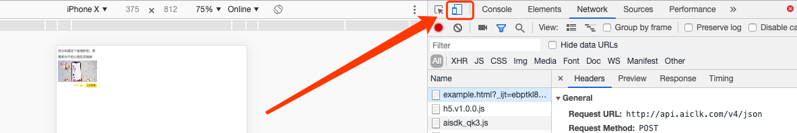

# CPC 游戏接入

>1.找商务获取广告ID<br>
>2.引入SDK


### 关于广告尺寸

350:125等比例缩放，横屏是125:350。

###  关于广告关闭
需要接入厂商在容器自己设置关闭按钮

### 引入 sdk

```
<script type="text/javascript" src="//newidea4-gamecenter-frontend.1sapp.com/sdk/prod/h5.v1.0.0.js"></script>
```

#### 图文广告

调用示例：

```
/**
@param aid {Number / String} [必填] 广告位id
@param container {String} [必填] 容器id html元素的id <div id="{这个}"></div>
@param adType {String} [选填] 广告类型 图文：image 视频：video 默认：image
**/
// 示例
qttGame.cpcAd({aid: '123', container: 'ad1'})
```

##### 注意

测试广告 ID 有效性: [https://newidea4-gamecenter-frontend.1sapp.com/sdk-test-aid/prod/index.html](https://newidea4-gamecenter-frontend.1sapp.com/sdk-test-aid/prod/index.html)

在 PC 端 Chrome 调试的时候需要调整为手机模式:



#### 视频广告

调用示例：

```
/**
@param aid {Number / String} [必填] 广告位id
@param container {String} [必填] 容器id html元素的id <div id="{这个}"></div>
@param adType {String} [视频广告必填] 广告类型 图文：image 视频：video 默认：image
@param rewardTime {Number} [选填] 广告时间 单位：秒 默认 15秒
@param endedCallback {Function} [视频广告必填] 广告结束回调函数
**/
// 示例
qttGame.cpcAd({
  aid: '123',
  container: 'test2',
  adType: 'video',
  rewardTime: 15,
  endedCallback: function (e) {
    if (e <= 0) {
        console.log('播放完毕，领取奖励。')
    }
  }
})
```

##### 注意

若在 PC 端测试，地址栏地址里需添加参数 ```dc=866988038992334```:

```
http://192.168.138.132:4132/test0.html?dc=866988038992334
``` 

在 `head` 里面最好固定浏览器宽度。

```
<meta name="viewport" content="width=device-width, initial-scale=1.0, maximum-scale=1, minimum-scale=1, user-scalable=no">
```

#### 互动广告

调用示例：

```
/**
 * @param {imgUrl:100*100,title:道具文字} data 道具参数
 * @param {*} callback 回调(参数为1 表示中奖)
 * @param {*} tuiaid 广告 ID
 * @param {*} appKey 媒体 ID
 */
qttGame.interactInit({
    data: {
      imgUrl: 'http://newidea4-gamecenter-cms.1sapp.com/icons/img1551095746313.png?x-oss-process=image/resize,w_150',
      title: '道具文字'
    },
    callback: function (event) {
      console.log('关闭互动广告')
      if (event == 1) {
        // 中奖
      }
    },
    tuiaid: 123,
    appKey: ''
})
```
